<div align="center">

[English](README_EN.md) | 中文

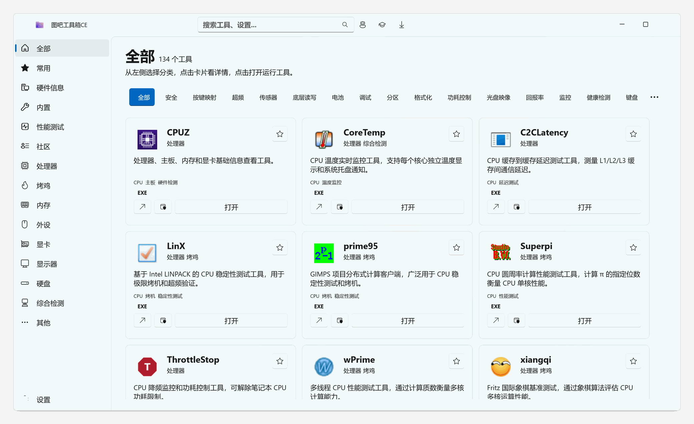

# 图吧工具箱CE

**图吧工具箱的社区重构版（Community Edition）** —— 基于 WinUI 3 / .NET 10 全新打造

<a href="https://readme-typing-svg.demolab.com?font=Fira+Code&size=28&pause=1000&color=0078D4&center=true&vCenter=true&width=600&lines=PC+%E7%A1%AC%E4%BB%B6%E5%B7%A5%E5%85%B7%E9%9B%86%E5%90%88;WinUI+3+%C2%B7+.NET+10;89+%E6%AC%BE%E6%94%B6%E5%BD%95%E5%B7%A5%E5%85%B7+%2B+47+%E6%AC%BE%E5%86%85%E7%BD%AE%E5%B7%A5%E5%85%B7;%E4%B8%80%E9%94%AE%E5%90%AF%E5%8A%A8">

</a>

[](LICENSE)
[](https://dotnet.microsoft.com/)
[](https://learn.microsoft.com/windows/apps/winui/)
[](https://github.com/luolangaga/tubatool)
[](https://gitcode.com/luolangaga/tubatool)
[](https://github.com/luolangaga/tubatool)

<a href="https://hellogithub.com/repository/luolangaga/tubatools" target="_blank"></a>
<a href="https://atomgit.com/luolangaga/tubatool"></a>
<a href="https://trendshift.io/repositories/51042?utm_source=trendshift-badge&utm_medium=badge&utm_campaign=badge-trendshift-51042" target="_blank" rel="noopener noreferrer"></a>
<a href="https://trendshift.io/repositories/51042?utm_source=trendshift-badge&utm_medium=badge&utm_campaign=badge-trendshift-51042" target="_blank" rel="noopener noreferrer"></a>

[官网文档](https://tubawinui3.cn) | [下载](https://github.com/luolangaga/tubatool/releases) | [反馈](https://github.com/luolangaga/tubatool/issues) | [讨论](https://github.com/luolangaga/tubatool/discussions)

</div>

> [!WARNING]
> 近期有许多非官方下载渠道，请注意甄别风险！请仅通过本文档「[安装方式](#安装方式)」列出的官方渠道下载。

---

## AtomGit G-Star 毕业项目

本项目已通过 [AtomGit](https://atomgit.com) 官方评审，获得 **G-Star 项目毕业认证**（编号 No.0614，2026.07.24），感谢 AtomGit 对图吧工具箱CE开源生态贡献的认可。

欢迎在 AtomGit 上关注我们：**[atomgit.com/luolangaga/tubatool](https://atomgit.com/luolangaga/tubatool)**

<div align="center">


</div>

---

## 目录

- [功能亮点](#功能亮点)
- [界面一览](#界面一览)
- [AI 助手](#ai-助手)
- [硬件检测与性能](#硬件检测与性能)
- [游戏工具箱](#游戏工具箱)
- [系统优化与安全](#系统优化与安全)
- [网络工具](#网络工具)
- [格式转换](#格式转换)
- [实用工具](#实用工具)
- [内置工具（47 款）](#内置工具47-款)
- [收录工具（89 款）](#收录工具89-款)
- [第三方工具与授权说明](#第三方工具与授权说明)
- [安装方式](#安装方式)
- [系统兼容性](#系统兼容性)
- [从源码构建](#从源码构建)
- [交流群聊](#交流群聊)
- [贡献者](#贡献者)
- [Code signing policy](#code-signing-policy)
- [许可证](#许可证)
- [捐赠支持](#捐赠支持)

---

## 功能亮点

<table>
<tr>
<td width="50%">

**AI 助手**
内置智能系统代理，可诊断问题、优化配置、读写文件、执行命令、联网搜索

</td>
<td width="50%">

**硬件信息与实时监控**
CPU / GPU / 内存 / 硬盘温度、频率、功耗实时监测

</td>
</tr>
<tr>
<td width="50%">

**性能测试与跑分**
CPU / GPU / 内存 / 硬盘 / 浏览器全项测试，导出 PDF 报告，社区云端排行榜对比

</td>
<td width="50%">

**格式转换**
图片 / 音视频 / Word / Excel / PPT / PDF 互转，OCR 识别、PDF 合并拆分、批量队列

</td>
</tr>
<tr>
<td width="50%">

**游戏工具箱**
可自定义布局的 FPS / 温度 / 负载监控悬浮层，一键虚拟局域网联机，运行库修复

</td>
<td width="50%">

**系统优化与安全**
垃圾清理 / 启动项管理 / 右键菜单管理 / 恶意软件拦截 / 沙盒分析 / 时间同步

</td>
</tr>
<tr>
<td width="50%">

**网络工具**
网速测试 / 流量监控 / 端口占用 / Hosts 编辑 / 局域网文件分享

</td>
<td width="50%">

**原生 Fluent 体验**
云母（Mica）材质、圆角窗口、亮暗主题、多语言界面、全局搜索、收藏与拖拽排序

</td>
</tr>
</table>

---

## 界面一览

<table>
<tr>
<td width="50%" align="center">
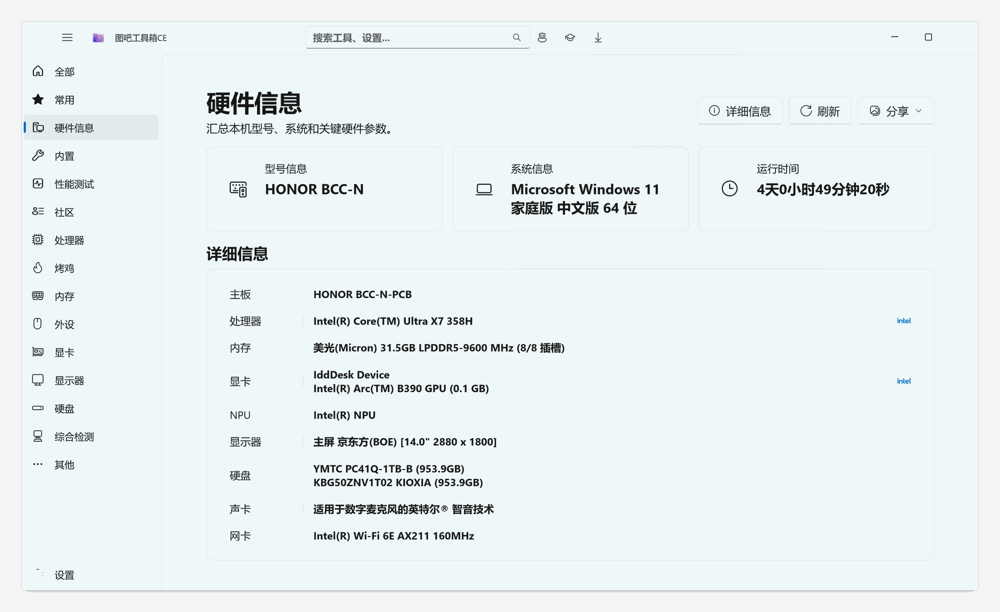<br/>
<b>硬件信息</b><br/>
<sub>型号 / 系统 / 处理器 / 内存 / 显卡 / 硬盘 / 网卡一览，支持实时监控</sub>
</td>
<td width="50%" align="center">
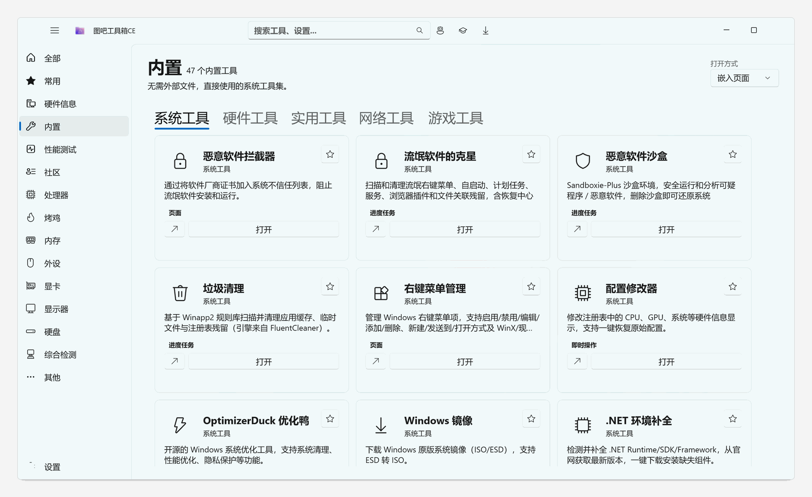<br/>
<b>内置工具库</b><br/>
<sub>47 款原生工具，按系统 / 硬件 / 网络 / 游戏 / 实用分类，随开随用</sub>
</td>
</tr>
<tr>
<td width="50%" align="center">
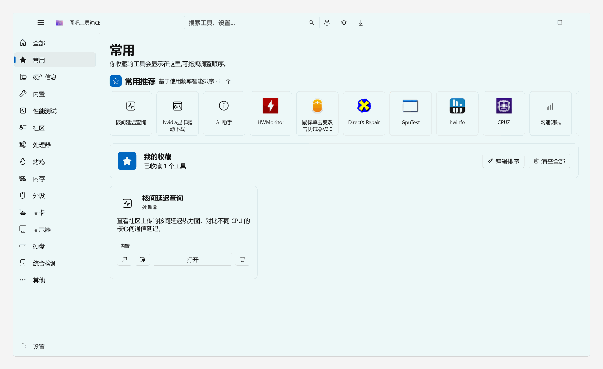<br/>
<b>常用与推荐</b><br/>
<sub>基于使用频率的智能推荐，收藏工具可拖拽排序，星标一键加入</sub>
</td>
<td width="50%" align="center">
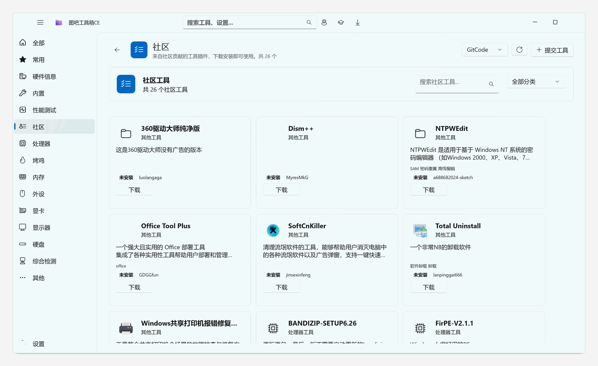<br/>
<b>社区工具</b><br/>
<sub>社区贡献的工具插件，选源下载即用，支持提交与删除</sub>
</td>
</tr>
<tr>
<td width="50%" align="center">
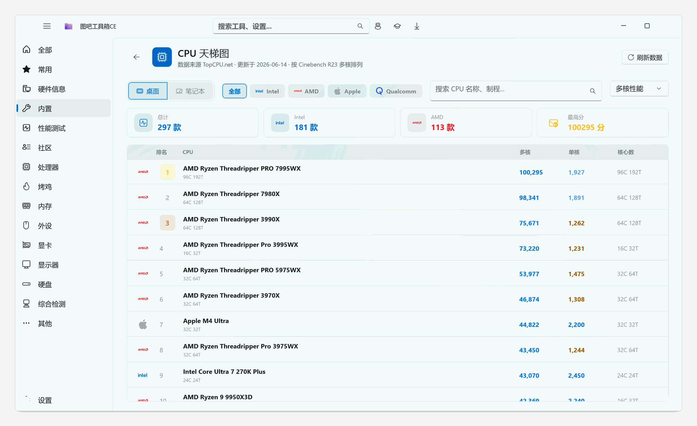<br/>
<b>CPU / GPU 天梯图</b><br/>
<sub>桌面 / 笔记本性能天梯图，支持品牌筛选与排序（数据来自 NanoReview）</sub>
</td>
<td width="50%" align="center">
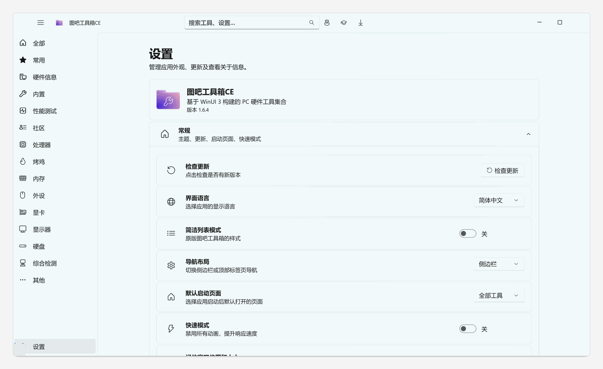<br/>
<b>设置中心</b><br/>
<sub>外观材质、界面语言、导航布局、快捷模式、自动更新、数据迁移与备份</sub>
</td>
</tr>
</table>

---

## AI 助手

内置的智能系统代理首次把「让 AI 直接操作电脑」做进工具箱：不仅回答问题，还能调用系统工具——读取硬件信息、分析磁盘占用、清理垃圾、读写文件、执行命令、联网搜索。

<table>
<tr>
<td align="center">
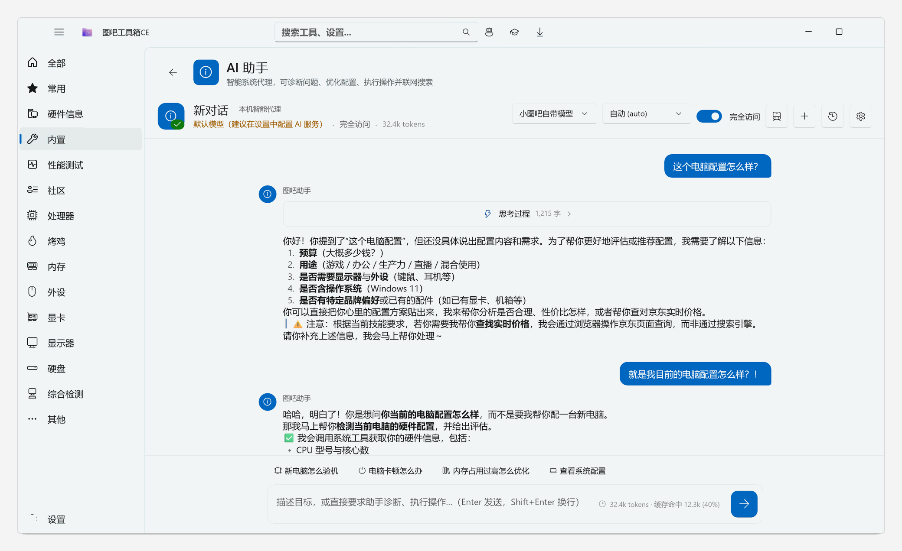<br/>
<sub>支持思考过程展示、内联工具调用与危险操作确认；可配置任意 OpenAI 兼容服务商与模型</sub>
</td>
</tr>
</table>

- **系统级工具调用**：内置 28 个 Agent 工具（硬件信息、磁盘分析、进程管理、文件读写、命令执行、联网搜索等），危险操作弹窗确认
- **完全访问模式**：可开关的「完全访问」权限，放开后无需逐条确认，专家用法一气呵成
- **思考过程可视化**：推理链（reasoning）流式展示，长回复自动折叠
- **记忆与技能**：跨会话记忆（memory.md）、技能（skills）按会话启用，用得越久越懂你的机器
- **模型自由**：内置小图吧自带模型开箱即用，也可接入任意 OpenAI 兼容端点（DeepSeek / OpenAI / 本地模型……）

---

## 硬件检测与性能

### 性能测试与跑分排行

CPU / GPU / 内存 / 硬盘 / 浏览器五大项全测，按比例折算「游戏性能 / 办公性能」评分并导出专业 PDF 报告；测试结果可上传社区排行榜，与同硬件用户同台对比。

<table>
<tr>
<td width="50%" align="center">
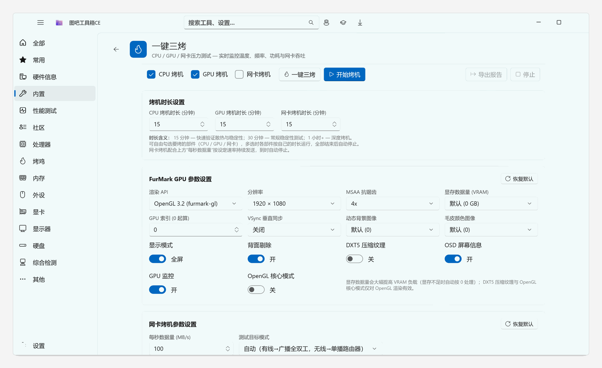<br/>
<b>一键三烤</b><br/>
<sub>CPU / GPU / 网卡自由勾选烤机，实时监控温度、频率、功耗与网卡吞吐</sub>
</td>
<td width="50%" align="center">
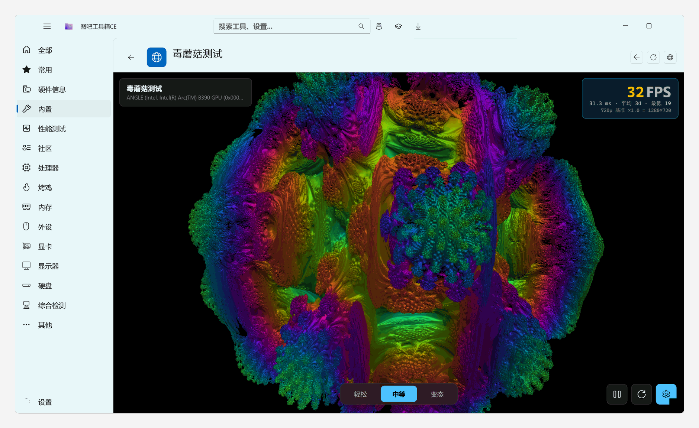<br/>
<b>毒蘑菇测试</b><br/>
<sub>GPU 分形压力测试，轻松 / 中等 / 变态三档压力，超分辨率渲染 + 实时帧率</sub>
</td>
</tr>
<tr>
<td width="50%" align="center">
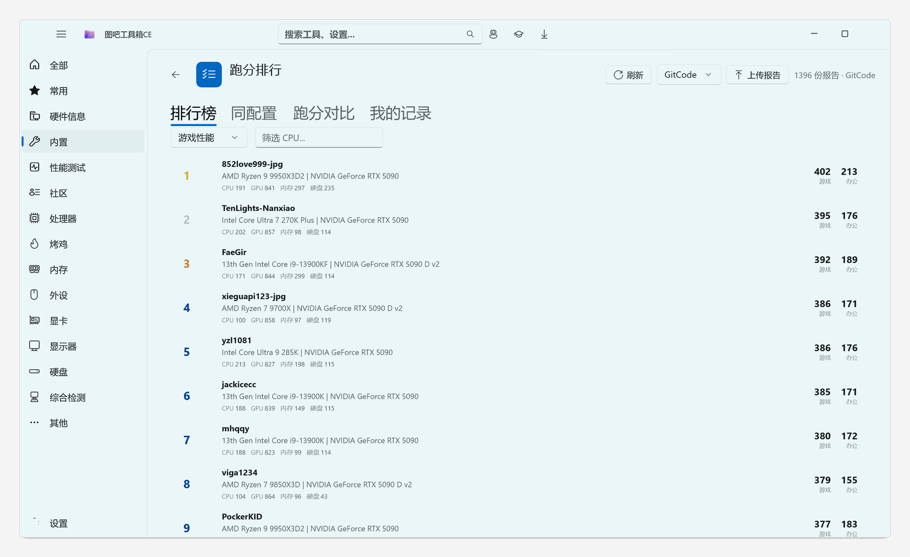<br/>
<b>跑分排行</b><br/>
<sub>上传测试报告到社区，查看全球排行榜，与同硬件用户对比性能</sub>
</td>
<td width="50%" align="center">
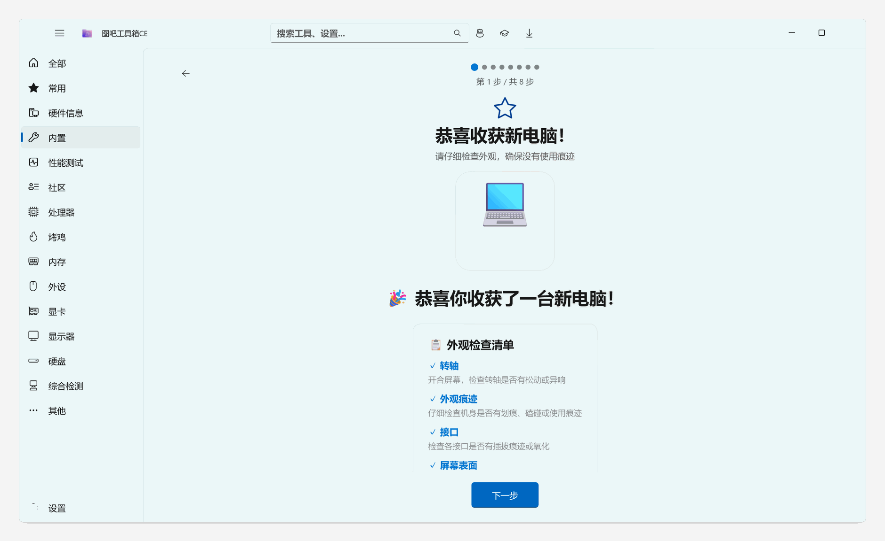<br/>
<b>快速验机</b><br/>
<sub>新电脑验机向导：外观 / 硬件 / 硬盘通电 / 屏幕坏点 / 外设 / 摄像头 / 音频一站式</sub>
</td>
</tr>
</table>

### 更多硬件工具

- **磁盘健康** — SMART 健康度检测（CrystalDiskInfo 方案）：温度 / 通电时间 / 寿命 / 读写量，支持 SSD TRIM 与机械盘碎片整理
- **电池消耗分析** — 电池消耗趋势与应用耗电排行，比 Windows 设置更强的电池报告
- **键盘测试** — 按键高亮检测，大 / 小键盘布局切换，可区分左右 Shift / Ctrl / Alt
- **屏幕坏点检测** — 全屏播放纯色与检测图案，快速发现坏点、漏光、色阶问题
- **GPU 天梯图 / 核间延迟查询** — 显卡性能天梯图与社区核间延迟热力图

---

## 游戏工具箱

### 游戏监控（覆盖层设计器）

拖拽式设计监控覆盖层：内置多种布局预设，可自由添加 FPS、CPU / GPU 温度与负载、内存占用等组件；游戏中实时显示，也可勾选指标记录数据（最长 2 小时），结束后一次性导出 JSON / Markdown / CSV 报告，配合「记录查看」图表化回放。

<table>
<tr>
<td width="50%" align="center">
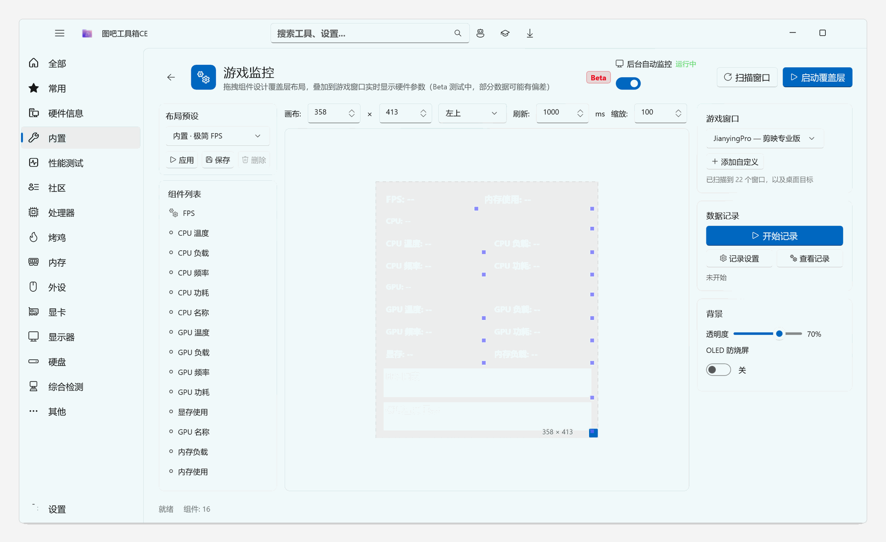<br/>
<b>游戏监控</b><br/>
<sub>拖拽设计覆盖层布局，自动识别游戏窗口，后台监控常驻运行</sub>
</td>
<td width="50%" align="center">
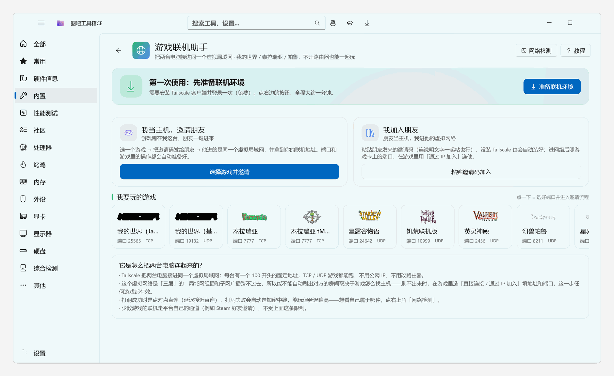<br/>
<b>游戏联机助手</b><br/>
<sub>虚拟局域网联机：邀请码一键入网，不用公网 IP、不用改路由器</sub>
</td>
</tr>
</table>

- **游戏联机助手** — 基于 Tailscale 的三层虚拟局域网，我的世界 / 泰拉瑞亚 / 幻兽帕鲁等 TCP / UDP 游戏都能直接连；朋友粘贴邀请码自动装客户端入网，内置防火墙一键放行与网络检测
- **记录查看** — 每个指标一张独立图表、各自纵轴刻度，支持分组切换、区间裁剪与 P1 / P99 统计
- **运行库修复** — 一键补齐 Visual C++ 2008-2026、.NET Framework、DirectX 旧版游戏组件（微软官方源 + 签名校验）
- **游戏防晕3D** — 屏幕中央准星 + 四边标记辅助，缓解 3D 眩晕

---

## 系统优化与安全

<table>
<tr>
<td width="33%" align="center">
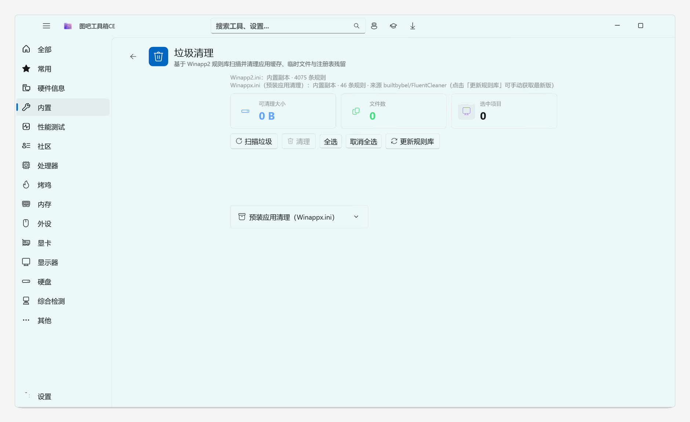<br/>
<b>垃圾清理</b><br/>
<sub>Winapp2 规则库（4000+ 条），清理缓存 / 临时文件 / 注册表残留</sub>
</td>
<td width="33%" align="center">
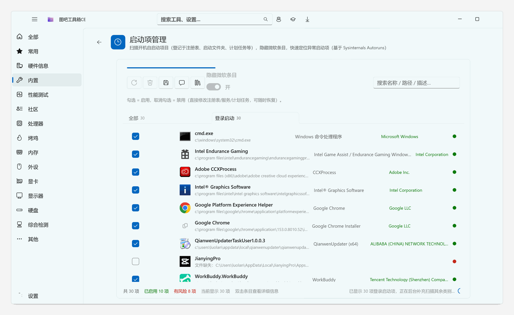<br/>
<b>启动项管理</b><br/>
<sub>注册表 Run / 启动文件夹 / 计划任务 / 服务，隐藏微软条目</sub>
</td>
<td width="33%" align="center">
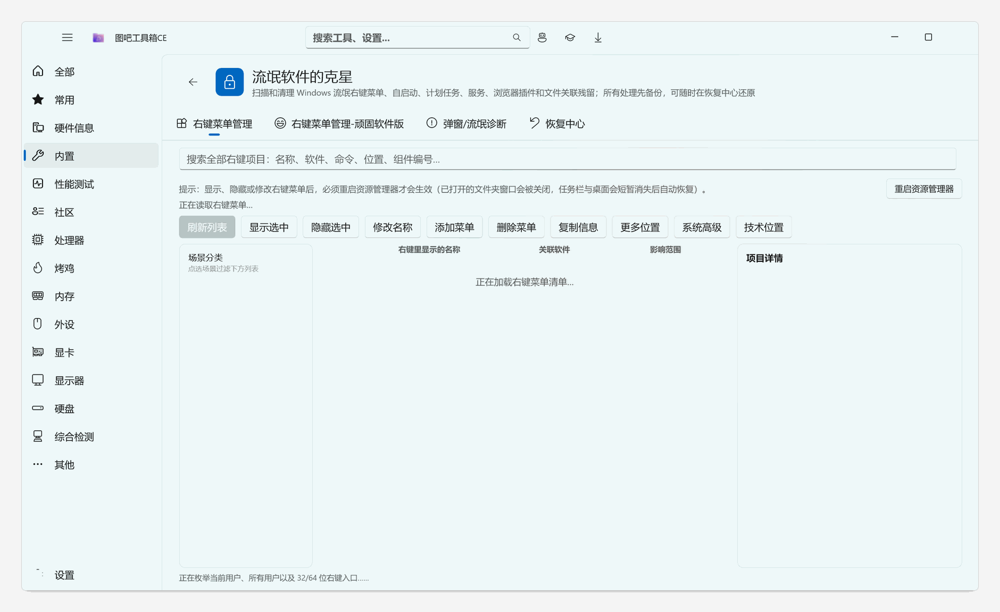<br/>
<b>流氓软件的克星</b><br/>
<sub>清理流氓右键菜单 / 自启动 / 计划任务 / 插件残留，含恢复中心</sub>
</td>
</tr>
</table>

- **恶意软件拦截器** — 把软件厂商证书加入系统不信任列表，从源头阻止流氓软件安装运行
- **恶意软件沙盒** — Sandboxie-Plus 沙盒环境，安全运行分析可疑程序，删沙盒即还原
- **右键菜单管理** — 启用 / 禁用 / 编辑 / 添加 / 删除右键菜单项，覆盖新建 / 发送到 / 打开方式与 WinX 菜单
- **时间同步** — 一键切换系统 NTP 服务器（阿里云 / 腾讯云 / 国家授时中心…），服务器测速、偏差检测、立即校时与一键修复
- **配置修改器 / Windows 隐藏功能 / .NET 环境补全 / 后台节流省电神器 / OptimizerDuck 优化鸭 / Windows 镜像下载** 等更多系统工具

---

## 网络工具

<table>
<tr>
<td width="33%" align="center">
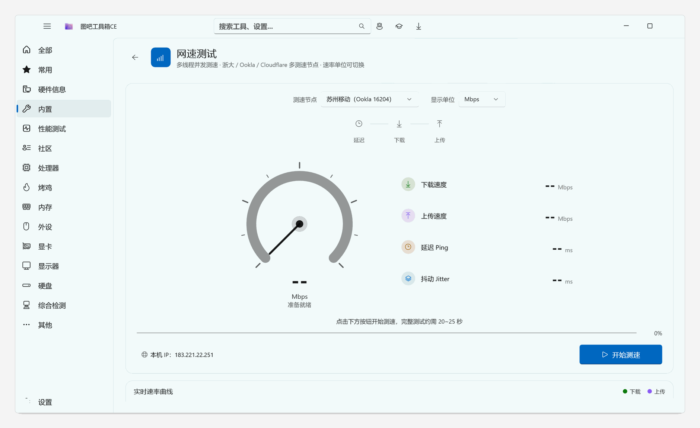<br/>
<b>网速测试</b><br/>
<sub>延迟 / 下载 / 上传原生测速，浙大 / Ookla / Cloudflare 多节点</sub>
</td>
<td width="33%" align="center">
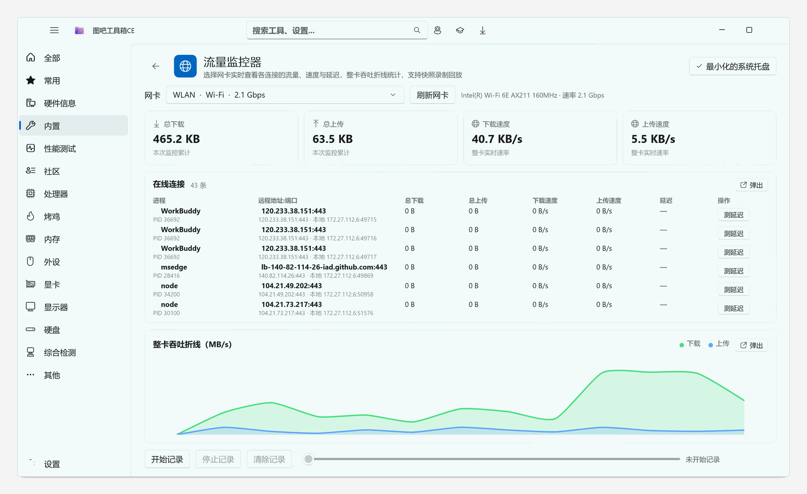<br/>
<b>流量监控器</b><br/>
<sub>实时查看各连接流量、速度与延迟，整卡吞吐折线统计</sub>
</td>
<td width="33%" align="center">
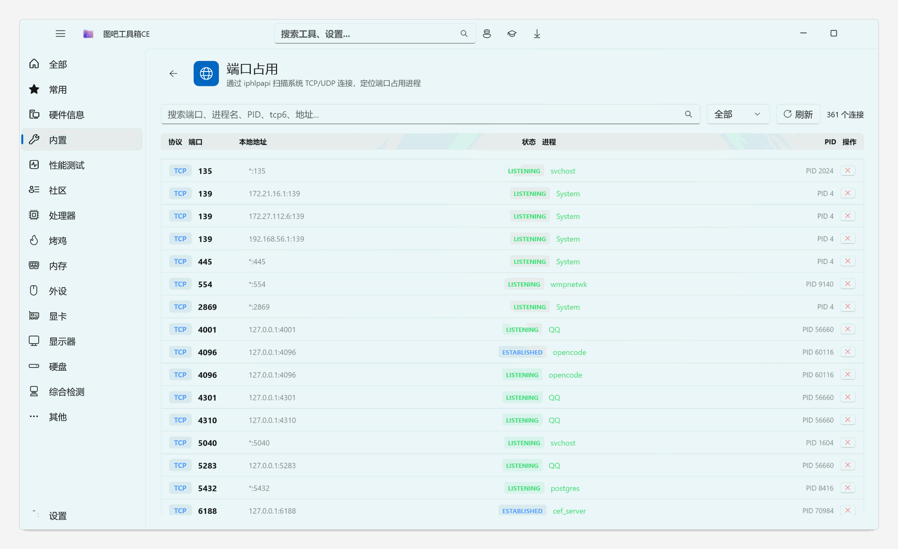<br/>
<b>端口占用</b><br/>
<sub>查看系统 TCP / UDP 端口占用情况，定位占用进程</sub>
</td>
</tr>
</table>

- **Hosts 编辑** — 可视化编辑系统 Hosts，支持启用 / 禁用规则和 DNS 刷新
- **WiFi 密码** — 查看本机连接过的 WiFi 网络名称和密码
- **网络优化** — TCP 参数优化、DNS 延迟测速与配置、公网 IP 查询、网络重置与 DHCP 修复
- **网络调度器** — 汇聚多网络适配器，智能分配流量，Wi-Fi 有线自动加速
- **局域网文件分享** — 局域网内 HTTP 文件分享服务，其他设备浏览器直接访问，支持拖拽上传

---

## 格式转换

拖入文件、选目标格式、批量队列逐个转换：图片 / 音视频 / Word / Excel / PPT / PDF / 文本 / JSON 全部互转，单个文件失败不打断批次。

<table>
<tr>
<td align="center">
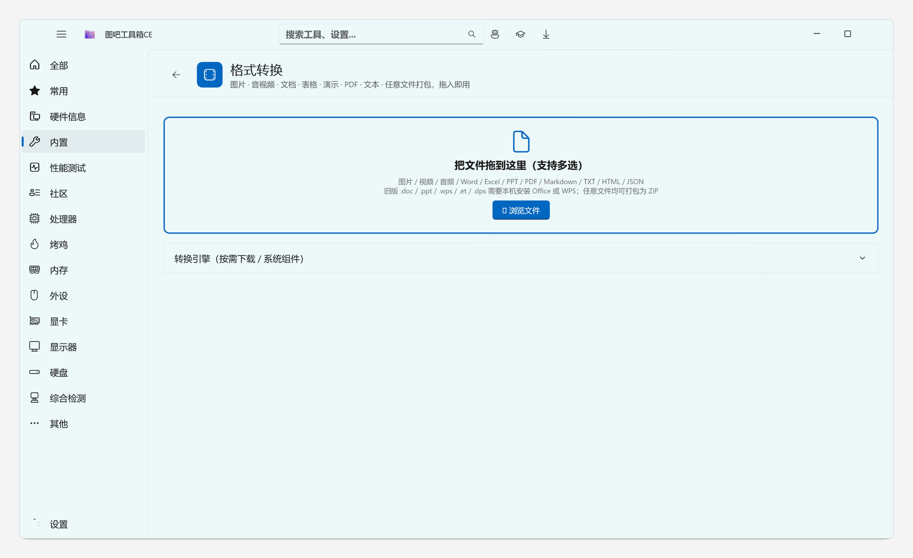<br/>
<sub>支持拖入与多选，批量队列处理，可打包 ZIP 交付</sub>
</td>
</tr>
</table>

- **文档转换** — Word / Excel / PPT / PDF / Markdown / HTML / JSON 互转；OOXML 文档内置渲染引擎逐页截图导出 PDF / 长图，中文排版零重采样
- **图片 / 音视频** — FFmpeg + ImageMagick 双引擎，每个目标格式自带可调参数（码率 / 位深 / 采样率 / CRF / 分辨率 / 帧率……）
- **OCR 识别** — 调用 Windows 原生 OCR，图片转文字一步到位
- **PDF 工具** — 合并、拆分、文字层提取表格转 XLSX
- **旧格式兜底** — .doc / .ppt / .wps 等老格式自动调用本机 Office / WPS 转换，缺失时给出明确提示

---

## 实用工具

<table>
<tr>
<td width="50%" align="center">
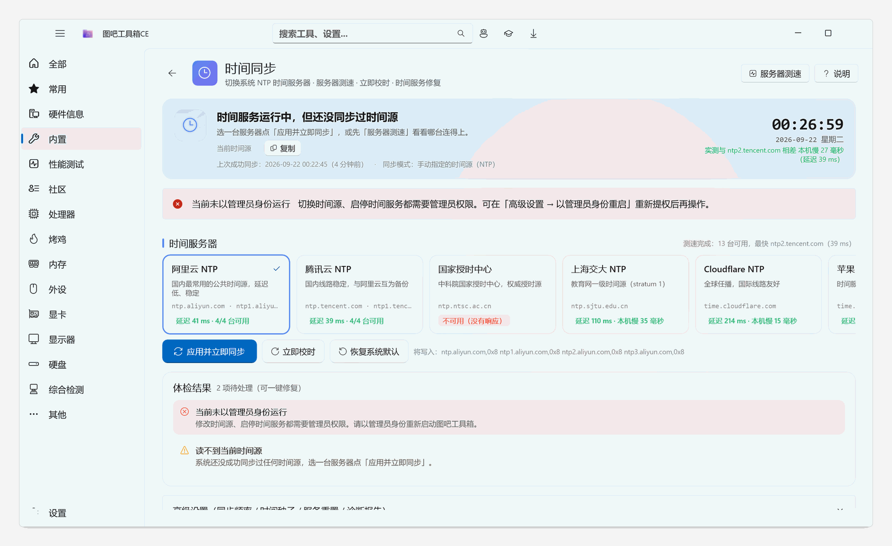<br/>
<b>时间同步</b><br/>
<sub>NTP 服务器切换与测速、时间偏差检测、一键校时与服务修复</sub>
</td>
<td width="50%" align="center">
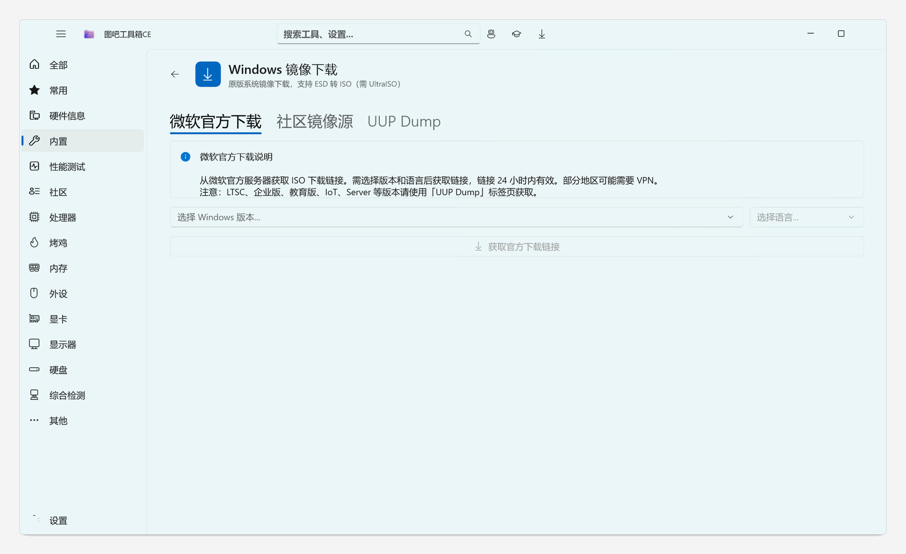<br/>
<b>Windows 镜像下载</b><br/>
<sub>UUP Dump 官方 API 三步向导：选版本 / 语言 → 下载 → 自动转换 ISO</sub>
</td>
</tr>
</table>

- **电脑使用教程** — 新电脑开箱指南、基础操作、烤机检测、常识与辟谣
- **常用官网** — Steam、Epic、UU 加速器等常用软件官网一键直达
- **服务网点查询** — 各大品牌笔记本 / 台式机官方服务网点地址
- **正版软件商店 / UniGetUI** — 基于 WinGet 及 winget / scoop / chocolatey / pip / npm 的软件安装与管理
- **电子文盲测试** — 25 道电脑基础知识选择题，测测你的水平
- **社区工具** — 社区贡献的工具插件，下载安装即用（仅免安装版提供）

---

## 内置工具（47 款）

> 采用 Fluent Design 构建的原生工具体系，无需依赖第三方软件，覆盖系统优化、硬件检测、网络诊断、游戏增强等场景。

| 分类 | 数量 | 代表工具 |
|:----:|:----:|:---------|
| **系统工具** | 13 | 垃圾清理 / 流氓软件的克星 / 恶意软件拦截器 / 启动项管理 / 时间同步 / Windows 镜像 |
| **硬件工具** | 12 | 性能测试 / 一键三烤 / 毒蘑菇测试 / 快速验机 / 磁盘健康 / 键盘测试 / 电池分析 |
| **网络工具** | 8 | 网速测试 / 流量监控器 / 端口占用 / Hosts 编辑 / 局域网文件分享 / 网络优化 |
| **游戏工具** | 5 | 游戏监控 / 记录查看 / 游戏联机助手 / 运行库修复 / 游戏防晕3D |
| **实用工具** | 9 | AI 助手 / 格式转换 / 电脑使用教程 / 常用官网 / 正版软件商店 / UniGetUI |

<details>
<summary>点击展开完整工具列表</summary>

### 系统工具
- **恶意软件拦截器** - 通过将软件厂商证书加入系统不信任列表，阻止流氓软件安装和运行
- **流氓软件的克星** - 扫描和清理流氓右键菜单、自启动、计划任务、服务、浏览器插件和文件关联残留，含恢复中心
- **恶意软件沙盒** - Sandboxie-Plus 沙盒环境，安全运行和分析可疑程序 / 恶意软件，删除沙盒即可还原系统
- **垃圾清理** - 基于 Winapp2 规则库扫描并清理应用缓存、临时文件与注册表残留（引擎来自 FluentCleaner）
- **启动项管理** - 扫描开机自启动项目（注册表 Run、启动文件夹、计划任务、服务等），隐藏微软条目，快速定位异常自启动
- **右键菜单管理** - 管理 Windows 右键菜单项，支持启用 / 禁用 / 编辑 / 添加 / 删除、新建 / 发送到 / 打开方式及 WinX / 现代 / IE 菜单
- **配置修改器** - 修改注册表中的 CPU、GPU、系统等硬件信息显示，支持一键恢复原始配置
- **后台节流省电神器** - 通过 Windows 11 效率模式（EcoQoS）节流后台进程以省电降温，前台应用保持流畅（基于 Energy Star X 内核）
- **.NET 环境补全** - 检测并补全 .NET Runtime / SDK / Framework，从官网获取最新版本，一键下载安装缺失组件
- **Windows 隐藏功能** - 查询、启用、禁用、重置 Windows 实验性功能开关（ViVe 引擎移植，毫秒级响应）
- **Windows 镜像** - 下载 Windows 原版系统镜像（ISO / ESD），支持 ESD 转 ISO
- **时间同步** - 一键切换系统 NTP 时间服务器，支持服务器测速、偏差检测、立即校时、时间服务修复与恢复系统默认
- **OptimizerDuck 优化鸭** - 开源的 Windows 系统优化工具，支持系统清理、性能优化、隐私保护等功能

### 硬件工具
- **性能测试** - 全面测试 CPU / GPU / 内存 / 硬盘 / 浏览器性能，按比例计算游戏与办公性能评分，导出专业 PDF 报告
- **跑分排行** - 上传测试报告到社区，查看全球排行榜，与同硬件用户对比性能
- **一键三烤** - CPU / GPU / 网卡压力测试工具，自由勾选烤机项目，网卡烤机支持自定义数据量与速率参考，实时监控温度、频率、功耗与网卡吞吐
- **毒蘑菇测试** - GPU 分形压力测试：轻松 / 中等 / 变态三档压力，超分辨率渲染突破屏幕，实时帧率监控
- **快速验机** - 新电脑验机向导：外观检查、硬件信息、硬盘通电、屏幕坏点、外设测试、摄像头、音频、三烤测试，一站式完成
- **磁盘健康** - SMART 健康度检测（CrystalDiskInfo 方案）：温度 / 通电 / 寿命 / 读写量，支持 SSD TRIM 与机械盘碎片整理
- **电池消耗分析** - 分析电池消耗趋势、应用耗电排行，比 Windows 设置更强大的电池分析工具
- **键盘测试** - 检测键盘按键是否正常，按键后高亮显示，支持大 / 小键盘布局切换，可区分左右 Shift / Ctrl / Alt，支持 Copilot 键
- **屏幕坏点检测** - 全屏播放纯色与检测图案，快速发现屏幕坏点、漏光、色阶问题
- **CPU 天梯图 / GPU 天梯图** - 查看桌面 / 笔记本性能天梯图，支持品牌筛选与排序（数据来自 NanoReview）
- **核间延迟查询** - 查看社区上传的核间延迟热力图，对比不同 CPU 的核心间通信延迟

### 网络工具
- **网速测试** - 原生测试网络延迟、下载与上传速度，支持浙大 / Ookla / Cloudflare 多测速节点切换
- **流量监控器** - 选择网卡实时查看各连接的流量、速度与延迟，整卡吞吐折线统计，支持快照录制与滑条回放
- **端口占用** - 查看系统所有 TCP / UDP 端口占用情况，定位占用进程
- **Hosts 编辑** - 可视化编辑系统 Hosts 文件，支持启用 / 禁用规则和 DNS 刷新
- **WiFi 密码** - 查看本机已连接过的 WiFi 网络名称和密码
- **网络优化** - TCP 参数优化（拥塞控制 / Chimney / Nagle / 网卡节能）、DNS 延迟测速与配置、公网 IP 查询、网络重置与 DHCP 修复
- **网络调度器** - 汇聚多网络适配器，智能分配流量，Wi-Fi 有线自动加速
- **局域网文件分享** - 在局域网内创建 HTTP 文件分享服务，其他设备可通过浏览器访问和下载文件，支持拖拽上传

### 游戏工具
- **游戏监控** - 拖拽组件设计监控覆盖层，内置多种布局预设，实时显示 FPS、温度、负载等硬件参数，可勾选指标记录数据并导出 JSON / Markdown / CSV 报告
- **记录查看** - 解析游戏监控导出的 JSON / CSV 记录，回放 FPS、温度、负载等历史数据：每个指标一张独立图表、各自纵轴刻度，支持分组切换、区间裁剪与 P1 / P99 统计
- **游戏联机助手** - 虚拟局域网联机：把两台电脑接进同一个虚拟网络，朋友粘贴邀请码就能进，不需要公网 IP 也不用改路由器
- **运行库修复** - 检测并修复缺失的 Visual C++ 2008-2026、.NET Framework 4.8.1、DirectX 旧版游戏组件，微软官方源下载 + 签名校验
- **游戏防晕3D** - 屏幕中央准星 + 四边标记辅助，缓解 3D 眩晕

### 实用工具
- **AI 助手** - 智能系统代理，可诊断问题、优化配置、读写文件、执行命令、联网搜索并执行操作
- **格式转换** - 图片 / 音视频 / Word / Excel / PPT / PDF / 文本互转，OCR 识别、PDF 合并拆分、任意文件打包 ZIP，批量队列、拖入即用
- **电脑使用教程** - 新电脑开箱指南、基础操作、烤机检测、常识与辟谣，手把手教你用好电脑
- **常用官网** - 收录 Steam、Epic、UU 加速器等常用软件官方网站，一键直达
- **服务网点查询** - 查询各大品牌笔记本、台式机官方服务网点地址
- **正版软件商店** - 浏览并安装正版软件，基于 WinGet 软件源
- **UniGetUI 包管理器** - 开源的 Windows 包管理器 GUI，支持 winget / scoop / chocolatey / pip / npm 等多种包管理器
- **电子文盲测试** - 测试你的电脑基础知识水平：25 道选择题，满分 100 分
- **社区工具** - 来自社区贡献的工具插件，下载安装即可使用，支持提交和删除工具（仅免安装版提供）

</details>

---

## 收录工具（89 款）

> 随包收录 **89 款**经典第三方工具，覆盖硬件检测全场景，一键启动、无需安装；也可把自己的工具放进 `Tools/` 目录自动识别。

| 类别 | 数量 | 代表工具 |
|:----:|:----:|:--------|
| 处理器工具 | 9 | CPU-Z / Core Temp / ThrottleStop / LinX / Prime95 / Superpi / wPrime / C2CLatency |
| 显卡工具 | 9 | GPU-Z / DDU / GpuTest / dxvachecker / nvidiaProfileInspector / AMD·NVIDIA 驱动下载 |
| 硬盘工具 | 22 | CrystalDiskMark / CrystalDiskInfo / DiskGenius / HDTune / WizTree / finaldata / URWTEST |
| 内存工具 | 7 | MemTest / MemTest64 / TM5 / Thaiphoon Burner / ZenTimings / 魔方内存盘 |
| 综合检测 | 5 | AIDA64 / HWiNFO / HWMonitor / Speccy / RWEverything |
| 外设工具 | 7 | Keyboard Test / Mouse Rate / MouseTester / KeyTweak / 在线外设测试中心 |
| 显示器工具 | 3 | 色域检测 / UFO 测试 / Windows HDR Calibration |
| 烤鸡工具 | 1 | FurMark 烤机版 |
| 其他工具 | 26 | Everything / Dism++ / Rufus / Ventoy / Autoruns / ProcessMonitor / BlueScreenView / DirectX 修复 |

完整工具列表详见 [官网文档](https://tubawinui3.cn)

---

## 第三方工具与授权说明

> [!IMPORTANT]
> `TubaWinUi3.WinUI3/Tools/`、下载功能拉取的外部工具、第三方图标/商标/数据等内容不属于本项目原创代码，**不自动适用 GPL-3.0**。
> 这些内容仅可在其各自许可证、版权声明或权利人授权范围内使用与分发。

- 本项目原创源代码、脚本、配置、文档与原创资源：按 [LICENSE](LICENSE)（GPL-3.0）授权。
- 第三方工具及其附带文件（例如 `TubaWinUi3.WinUI3/Tools/**` 下各工具目录中的 `LICENSE*`、`COPYING*`、`EULA*` 等）：按各自条款执行，本项目不对其进行再许可。
- 第三方商标、品牌名称、图标与数据归其各自权利人所有，仅作识别或兼容用途，不代表授权、背书或从属关系。
- 对许可证未知、权利状态不明确或不适合分发的第三方内容，请维护者/分发者在发布前自行核验权利来源；本仓库不作“已获完整授权”的断言。

集中说明见：[THIRD-PARTY-NOTICES.md](THIRD-PARTY-NOTICES.md)。

---

## 安装方式

### GitHub Releases（推荐）

前往 [Releases](https://github.com/luolangaga/tubatool/releases) 下载最新版本。

提供两种形式：
- **便携版 (ZIP)** -- 解压即用，无需安装
- **安装版 (Inno Setup)** -- 传统安装程序

发布产物的签名策略见 [Code signing policy](#code-signing-policy)。

### GitCode Releases（国内镜像）

国内用户可从 [GitCode 镜像](https://gitcode.com/luolangaga/tubatool) 下载，速度更快。

### Winget（Windows 包管理器）

```powershell
winget install luolangaga.tubatools
```

### Scoop（Windows 包管理器）

```powershell
# 1. 添加图吧工具箱CE bucket
scoop bucket add tubatools https://github.com/luolangaga/scoop-tubatools

# 2. 安装（自动根据系统架构选择 x64 / arm64 便携版）
scoop install tubatools/tubatool
```

更新到最新版：`scoop update tubatool`

> 图吧工具箱CE的 Scoop 源仓库：[luolangaga/scoop-tubatools](https://github.com/luolangaga/scoop-tubatools)

### Microsoft Store（微软商店）

<a href="https://apps.microsoft.com/detail/9P15095X7MGB?referrer=appbadge&mode=full" target="_blank" rel="noopener noreferrer">
	
</a>

---

## 系统兼容性

| 平台 | 支持状态 |
|:----:|:--------:|
| x64 (Intel/AMD 64位) | ✅ 完全支持 |
| x86 (Intel/AMD 32位) | ✅ 完全支持 |
| ARM64 (高通骁龙等) | ✅ 原生支持 |

| Windows 版本 | 支持状态 |
|:------------:|:--------:|
| Windows 11 | ✅ 完全支持 |
| Windows 10 21H2+ | ✅ 完全支持 |
| Windows 10 1809+ | ✅ 最低支持 |

---

## 从源码构建

```bash
git clone https://github.com/luolangaga/tubatool.git
cd tubatool
dotnet build        # 编译
dotnet run          # 运行（Unpackaged 模式）
```

<details>
<summary>环境要求</summary>

- [.NET 10 SDK](https://dotnet.microsoft.com/download/dotnet/10.0)
- [Visual Studio 2022 17.14+](https://visualstudio.microsoft.com/) 或 [VS Code](https://code.visualstudio.com/)（配合 C# Dev Kit）
- 最低支持 Windows 10 1809
- 支持 x86 / x64 / ARM64

</details>

---

## 交流群聊

欢迎加入 QQ 群交流讨论：**485079194**

---

## 贡献者

感谢所有为本项目做出贡献的开发者！

<a href="https://github.com/luolangaga/tubatool/graphs/contributors">
  
</a>

---

## Code signing policy

> Free code signing provided by [SignPath.io](https://about.signpath.io), certificate by [SignPath Foundation](https://signpath.org).

由 [SignPath.io](https://about.signpath.io) 提供免费代码签名，证书由 [SignPath Foundation](https://signpath.org) 颁发。签名在自动化构建流程中完成，因此签名代表该二进制是由本仓库源码自动构建产生的 —— 构建须通过可信构建系统（GitHub Actions）校验来源，并经 Approver 人工批准后才会签名。

- **Committers / Reviewers**: [@luolangaga](https://github.com/luolangaga)
- **Approvers**: [@luolangaga](https://github.com/luolangaga)
- **隐私政策 / Privacy policy**: [PrivacyPolicy.txt](PrivacyPolicy.txt)

---

## 许可证

本仓库采用**分层许可说明**：

- **项目原创部分**（源代码、脚本、配置、文档、原创资源）采用 **GPL-3.0**，详见 [LICENSE](LICENSE)。
- **第三方内容**（随包收录工具、下载获取的外部工具、第三方二进制、商标、图标、数据与其他非原创内容）**不自动纳入 GPL-3.0**，请遵守其各自许可证或权利人授权，详见 [THIRD-PARTY-NOTICES.md](THIRD-PARTY-NOTICES.md)。
- 附带的 [License.txt](License.txt) 为软件使用须知与网络/隐私声明，不构成对 GPL-3.0 的附加限制。

> 提示：以上内容仅为项目文档说明，不构成法律意见。如需商业分发，或对具体第三方工具的权利状态有疑问，请咨询相应权利人或专业法律顾问。

---

<div align="center">


<a href="https://star-history.com/#luolangaga/tubatool&type=date&legend=bottom-right">
  <picture>
    <source media="(prefers-color-scheme: dark)" srcset="https://api.star-history.com/svg?repos=luolangaga/tubatool&type=date&theme=dark&legend=bottom-right" />
    <source media="(prefers-color-scheme: light)" srcset="https://api.star-history.com/svg?repos=luolangaga/tubatool&type=date&legend=bottom-right" />
    
  </picture>
</a>

**如果觉得有用，给个 Star 吧！**

</div>

---

## 捐赠支持

如果这个工具箱对你有帮助，欢迎请我喝杯奶茶 ☕ 感谢每一位支持者！

<div align="center">


</div>
